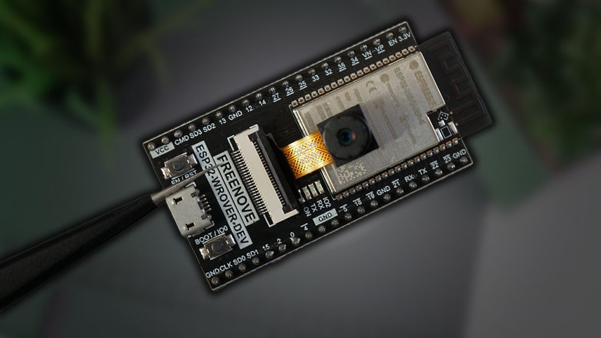

# Project README: Detecção de Fadiga em Motoristas.

# Brainstorming

Idéia 1 (Gabriel Rosa).

Sistema de som integrado na própria placa, fazendo com que erros humanos independam para o seu funcionamento.

Quando integrado no telefone, há diversas variáveis para interromper o funcionamento do mesmo.
Ex: Perda de telefone, esquecimento do telefone na mochila, telefone sem bateria.

## Instructions
-Etapas Gerais:

  Conectar a Câmera à ESP32:
        Conecte a câmera (por exemplo, OV2640) à ESP32-WROVER-Dev seguindo o esquema de pinos especificado nas documentações.

  Desenvolver o Software:
        Use a IDE Arduino ou PlatformIO para desenvolver o software na ESP32.
        Utilize bibliotecas para capturar imagens da câmera e transmiti-las ao vivo.

  Configurar a Transmissão de Vídeo:
        Configure o ESP32 para transmitir as imagens da câmera por meio de um protocolo de transmissão de vídeo, como RTSP (Real-Time Streaming Protocol) ou MJPEG (Motion JPEG).

  Implementar a Detecção de Fadiga:
        Desenvolva ou integre um algoritmo de detecção de fadiga do motorista. Pode envolver técnicas de processamento de imagem, como detecção de olhos fechados, bocejos, ou análise de movimentos da cabeça.

  Integração e Teste:
        Integre a detecção de fadiga ao fluxo de vídeo.
        Realize testes para garantir que o sistema detecta corretamente a fadiga do motorista.

  Transmissão de Dados:
        Pode ser necessário implementar uma solução para transmitir dados relevantes para um servidor ou outro dispositivo, dependendo dos requisitos do seu projeto.

  Implementar Medidas de Segurança:
        Implemente medidas de segurança para garantir que a transmissão de imagens e dados seja segura e privada.

  Otimização e Melhorias:
        Otimize o código e faça melhorias conforme necessário para garantir um desempenho eficiente e uma detecção confiável.

## Items Used (Hardware)
-ESP32-WROVER-Dev

-Câmera

## Apps and Tools

## opencv
- para inverter a image: img = cv.flip(img, 0)

## How it Streams Video
---

## Documentation
-ESP-WROVER-KIT is a highly integrated ultra-low-power development board, with rich peripheral set, Wi-Fi, and Bluetooth connectivity offered by Espressif's flagship SoC, ESP32. Create Internet cameras, smart displays, or Internet radios by connecting LCDs, microphones, and codecs. ESP32 supports JTAG debugging, while the ESP-WROVER-KIT integrates a USB debugger. This makes debugging and tracing complex applications very easy, without the need for any additional hardware. ESP32 is engineered to be fast, smart, and versatile. The ESP-WROVER-KIT complements these characteristics by offering an on-board high-speed Micro-SD card interface, VGA camera interface, as well as a 3.2 SPI LCD panel and I/O expansion capabilities. Have you been developing your applications around the ESP32-WROOM-32 module? Not only does the ESP-WROVER-KIT support the popular ESP-WROOM-32 module, but it also supports ESP32-WROVER module that has additional SPIRAM for your application's use.

Link(https://docs.espressif.com/projects/esp-idf/en/stable/esp32/hw-reference/esp32/get-started-wrover-kit.html)

## Picture

---
